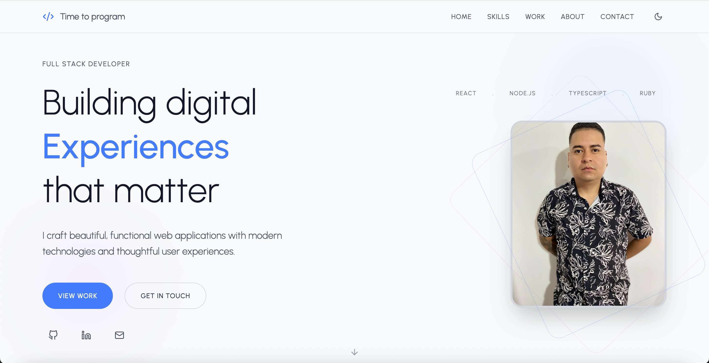

# 🧑‍💻 Daniel Londoño's Developer Portfolio

Welcome to my personal portfolio, built with **Vite**, **React**, **TypeScript**, and **Framer Motion**. This site showcases my development work, skills, and experience with a modern, responsive design — including full support for **dark mode**.

## 🚀 Tech Stack

- ⚡️ [Vite](https://vitejs.dev/) – Fast build tool for modern web development  
- ⚛️ [React](https://react.dev/) – Frontend library for building user interfaces  
- 🟦 [TypeScript](https://www.typescriptlang.org/) – Strongly typed JavaScript  
- 🎞 [Framer Motion](https://www.framer.com/motion/) – Smooth animations for React  
- 💨 [Tailwind CSS](https://tailwindcss.com/) – Utility-first CSS framework  
- 🌙 Dark Mode – Seamless toggle between light and dark themes  
- 🧠 [Ruby on Rails](https://rubyonrails.org/) – Full-stack framework for backend development  
- 🔥 [Hotwire](https://hotwired.dev/) – Real-time updates with minimal JavaScript  
- 🐘 PostgreSQL – Relational database for scalable apps

## ✨ Features

- Smooth animations and page transitions using Framer Motion  
- Responsive layout for mobile, tablet, and desktop  
- Projects section with GitHub and live demo links  
- Built-in light/dark theme toggle  
- Clean, modular codebase with TypeScript types

## 📸 Preview



## 🧩 Projects

### 📊 Survey-Rails

A full-stack application built to create, send, and manage surveys or questions. Designed for speed and responsiveness with modern Rails technologies.

- **Tech:** Ruby on Rails · Tailwind CSS · Hotwire · PostgreSQL  
- **GitHub:** [https://github.com/DanielEsLoH/course-rails](https://github.com/DanielEsLoH/course-rails)  
- **Live Demo:** [https://surveyrails.fly.dev/](https://surveyrails.fly.dev/)

---

### 🖥️ DLH-Portfolio

My personal developer portfolio to showcase my work, skills, and contact information. Built with a fast and modern tech stack including animations and responsive design.

- **Tech:** Vite · React · TypeScript · Framer Motion · TailwindCSS  
- **GitHub:** [https://github.com/DanielEsLoH/portfolio](https://github.com/DanielEsLoH/portfolio)  
- **Live Demo:** [https://danielesloh.github.io/portfolio/](https://danielesloh.github.io/portfolio/)

## 📂 Project Structure

src/
├── assets/ # Static images and resources
├── components/ # Reusable UI components
├── sections/ # Sections like About, Projects, Contact
├── hooks/ # Custom React hooks
├── types/ # Global TypeScript types
├── App.tsx # Main app component
├── main.tsx # Application entry point

## 🔧 Getting Started

To run the project locally:

```bash
git clone https://github.com/DanielEsLoH/portfolio
cd portfolio
npm install
```

### Environment Setup

1. Copy the example environment file:
```bash
cp .env.example .env
```

2. Get your Web3Forms API key from [https://web3forms.com/](https://web3forms.com/) (it's free!)

3. Open `.env` and add your API key:
```
VITE_WEB3FORM_KEY=your_actual_api_key_here
```

### Start Development Server

```bash
npm run dev
```

Open [http://localhost:5173](http://localhost:5173) in your browser.

## 📦 Scripts
npm run dev – Start the local development server
npm run build – Build the project for production
npm run preview – Preview the production build locally
🌐 Deployment
This portfolio can be easily deployed using:
Netlify
Vercel
GitHub Pages
🛠 Customization
You can update the following to personalize the site:
src/constants/ – Add your name, social links, and project data
components/ThemeToggle.tsx – Modify dark mode behavior
sections/ – Update or add new content blocks
📄 License
This project is licensed under the MIT License. You’re free to use, modify, or extend it — just credit where appropriate. 🤝
🙌 Connect with Me
Created with ❤️ by Daniel Londoño
